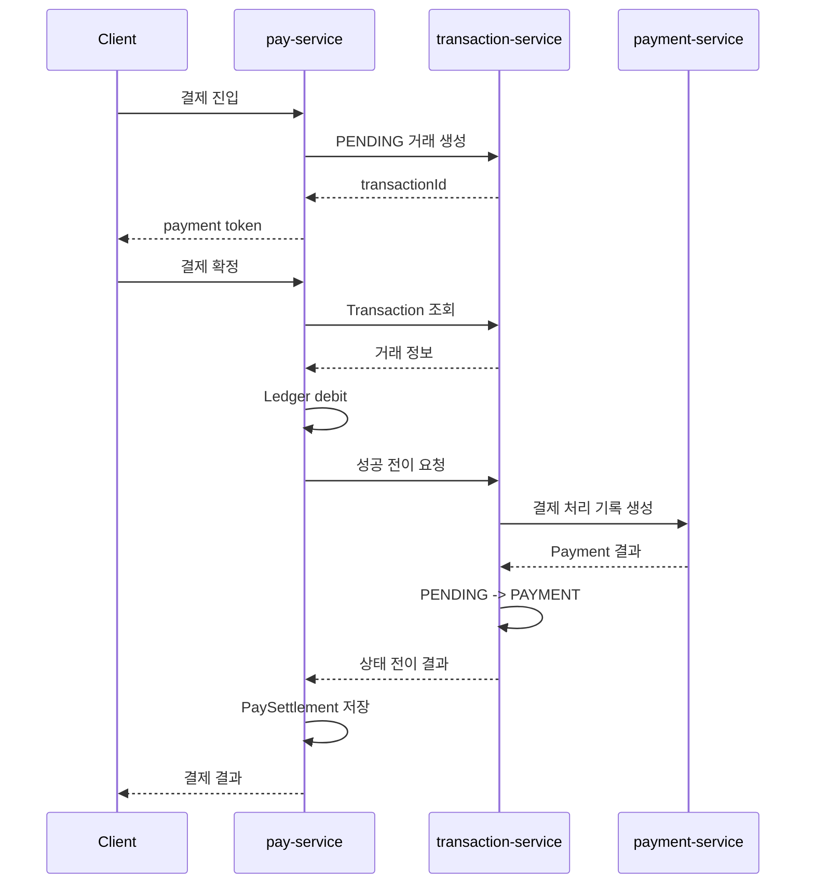
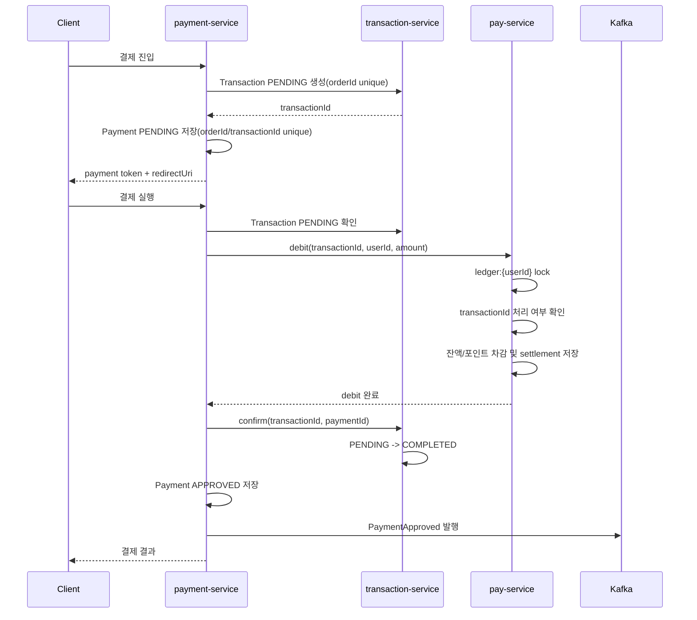
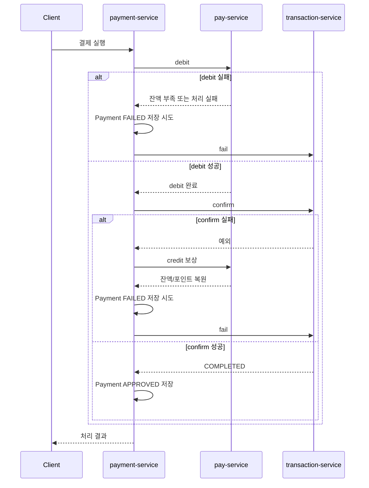

# 아키텍처

## 목표

자체 Pay 기반 결제 시스템에서 결제 흐름 조율 책임과 금전 원장 변경 책임을 분리하고 MSA 환경에서 중복 요청과 동일 사용자 동시 결제를 제어

| 비교 항목 | `main` (v2) | `refactor/payment-orchestration-saga` (v3) |
| --- | --- | --- |
| 결제 진입점 | `pay-service` | `payment-service` |
| 오케스트레이터 | `pay-service` | `payment-service` |
| Ledger 변경 | 결제 흐름 안에서 `pay-service`가 직접 처리 | `pay-service`의 `debit`/`credit` API로 분리 |
| Transaction 역할 | 상태 관리 + `payment-service` 호출 | 거래 생성과 상태 전이 전담 |
| Payment 역할 | 결제 처리 기록 저장 중심 | 자체 PG 성격의 진입점, 결제 상태 관리, 승인 이벤트 발행 |
| 중복 결제 방어 | `orderId` 기반 중복 방어 | `orderId`, `transactionId` 기반 중복 진입/중복 차감 방어 |
| 동일 사용자 동시 차감 | 서비스별 락 책임이 분산됨 | `ledger:{userId}` Redis lock으로 잔액 변경 직렬화 |
| 보상 처리 | Pay debit 이후 실패 시 상태 불일치 가능 | Transaction confirm 실패 시 Pay credit 보상 시도 |
| Kafka 사용 | Transaction 상태 이벤트 기반 후처리 | Payment 승인 후처리 이벤트 |

## 컴포넌트

| 컴포넌트 | 역할 |
| --- | --- |
| `payment-service` | 자체 PG 성격의 결제 진입점, 결제/환불/취소 오케스트레이션, Payment 상태 관리, 결제 토큰 발급, `PaymentApproved` 발행 |
| `pay-service` | 내부 Pay 지갑, 잔액/포인트/정산 원장 변경, Ledger 락, `PaymentApproved` 소비 후 포인트 적립 |
| `transaction-service` | Transaction PENDING 생성, COMPLETED/FAILED/REFUNDED/CANCELLED 상태 전이, Payment와 Transaction 연결 정보 관리 |
| `experiments/k6` | 중복 결제, 동일 사용자 동시 결제, 다중 사용자 결제 검증 트래픽 생성 |
| `experiments/wiremock` | 로컬 실험에서 `auth-service`를 대체하는 토큰 검증 Mock |

`payment-service`는 결제 진입점으로 토큰 발급과 최종 결제 실행을 조율

`pay-service`는 잔액/포인트 변경과 정산 기록 저장에 집중

`transaction-service`는 인증 책임 없이 거래 생성과 상태 전이를 처리

## 결제 흐름

### main (v2)



v2에서는 결제 흐름의 주도권이 `pay-service`에 있었음

`pay-service`는 내부 지갑 역할과 결제 진입, 토큰 발급, Transaction 확정 요청, 정산 저장을 함께 담당

`payment-service`는 Transaction에서 호출되는 결제 처리 기록 저장 역할에 가까웠음

### refactor/payment-orchestration-saga (v3)



v3에서는 결제 진입점을 `payment-service`로 이동

결제 흐름의 조율과 보상 판단은 `payment-service`의 동기 호출 흐름으로 처리. Kafka는 결제 승인 이후 포인트 적립, 알림 같은 후처리 이벤트에 사용

## 보상 흐름



현재 보상 로직은 오케스트레이션 사가의 최소 구현

`Pay debit` 이후 `Transaction confirm`이 실패하면 `Pay credit`으로 복원을 시도. 보상 실패 재처리용 Outbox, DLQ는 실험 범위에서 제외

## 실험 엔드포인트

| Method | Path | Service | 목적 |
| --- | --- | --- | --- |
| `POST` | `/v1/payments/initiate` | `payment-service` | 결제 진입, Transaction PENDING 생성, Payment PENDING 저장, 결제 토큰 발급 |
| `POST` | `/v1/payments` | `payment-service` | 결제 실행, Pay debit, Transaction confirm, Payment APPROVED 저장 |
| `POST` | `/v1/payments/refunds` | `payment-service` | 환불 실행 |
| `POST` | `/v1/payments/cancellations` | `payment-service` | 결제 취소 실행 |
| `GET` | `/v1/transactions/{transactionId}` | `transaction-service` | Transaction 상태 조회 |
| `POST` | `/v1/transactions` | `transaction-service` | Transaction PENDING 생성 |
| `POST` | `/v1/transactions/confirm` | `transaction-service` | Transaction COMPLETED 전이 |
| `POST` | `/v1/transactions/failures` | `transaction-service` | Transaction FAILED 전이 |
| `POST` | `/v1/pay/debit` | `pay-service` | 결제 시 잔액/포인트 차감 및 정산 기록 저장 |
| `POST` | `/v1/pay/credit` | `pay-service` | 보상/환불/취소 시 잔액/포인트 복원 |
| `GET` | `/actuator/health` | all services | 헬스 체크 |

실험 스크립트는 외부 클라이언트 관점에서 `payment-service`의 `/v1/payments/initiate`, `/v1/payments`를 호출

`pay-service`의 `/v1/pay/debit`, `/v1/pay/credit`은 `payment-service`가 호출하는 내부 Ledger API

## 결제 대기 만료

```text
payment-service Scheduler
  -> 만료 Payment PENDING 조회
  -> transaction-service: PENDING 확인
  -> transaction-service: FAILED 전이
  -> payment-service: Payment FAILED 저장
```

결제 대기 만료는 `payment-service`의 스케줄러가 담당

다중 Pod 환경에서는 스케줄러 중복 실행 제어나 분산락이 추가로 필요

## 인증 가정

`payment-service`와 `pay-service`는 `auth-service`의 `/v1/auth/validate-token` 호출로 토큰 검증을 위임

`transaction-service`는 내부 거래 상태 서버로 보고 JWT 검증을 두지 않음. 대신 `payment-service`가 검증한 사용자 식별자를 내부 요청 DTO로 전달

로컬 실험에서는 WireMock 기반 `mock-auth`가 토큰 검증 응답을 제공

## 트레이드오프

### 2PC -> 오케스트레이션 사가

- `payment-service`, `pay-service`, `transaction-service`가 각각 DB를 가지는 MSA 구조라 2PC는 결합도와 장애 전파 부담이 큼
- 결제 흐름은 `payment-service`가 단계별 호출과 보상 흐름을 조율하는 오케스트레이션 사가로 구성
- 강한 원자성 대신 실패 지점별 보상 호출로 최종 정합성을 맞추는 방향을 선택
- 보상 실패 재처리와 운영 처리 테이블은 제외

### 코레오그래피 사가 -> 오케스트레이션 사가

- 코레오그래피 사가는 이벤트 흐름이 여러 서비스로 분산되어 결제 실패 지점과 보상 처리를 추적하기 어려움
- 결제는 상태 전이 순서가 중요하므로 중앙 오케스트레이터가 흐름을 명시적으로 제어하는 구조를 선택
- 대신 `payment-service`에 결제 조율 책임이 집중됨

### DB 락 -> Redisson RedLock

- 잔액은 사용자 단위 공유 자원이므로 동일 사용자의 결제 요청을 직렬화해야 함
- 여러 인스턴스에서 같은 락 키를 공유할 수 있도록 DB 락 대신 Redis 기반 Redisson RedLock 사용
- 락 키는 잔액 소유자인 `userId` 기준의 `ledger:{userId}`로 설정
- Redis 장애나 락 획득 실패에 대한 운영 전략은 추가 검토 필요

### 결제 흐름 처리 -> Kafka 후처리 분리

- Kafka는 결제 승인 이후 후처리에 사용
- 포인트 적립, 알림 같은 작업은 결제 승인 응답과 분리 가능
- Payment 승인 저장 후 이벤트 발행 실패에 대비한 Transactional Outbox/DLQ는 제외

### 멱등성 키 분리

- 중복 결제 진입은 비즈니스 키인 `orderId`로 방어
- 중복 차감은 결제 실행 단위인 `transactionId`로 방어
- 환불/취소의 별도 멱등 키는 추가 개선 대상
