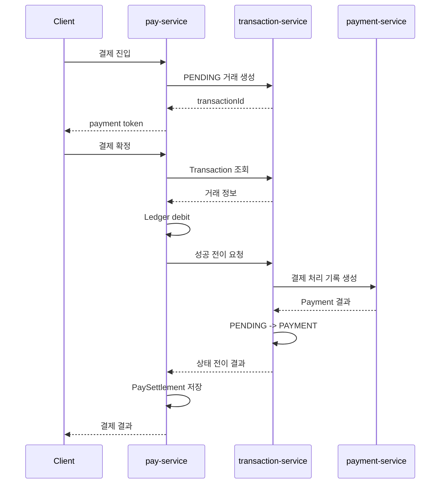
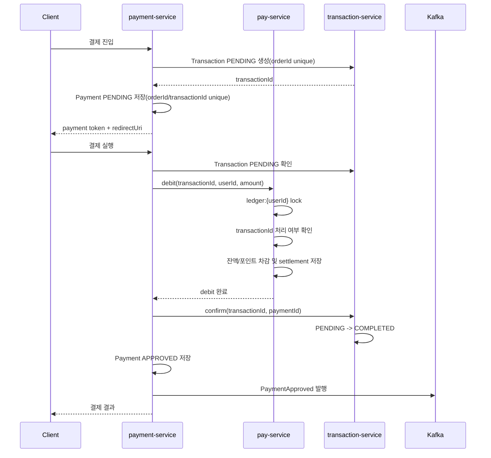
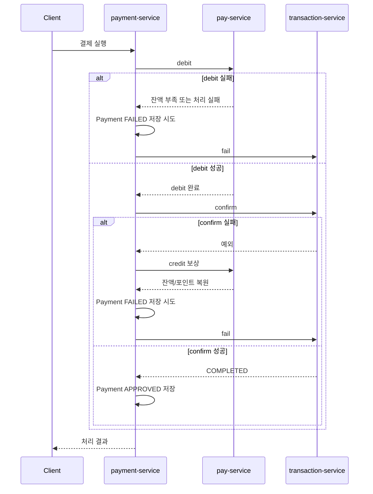

# Architecture

## Goal

자체 Pay 기반 결제 시스템에서 결제 흐름 조율 책임과 금전 원장 변경 책임을 분리하고, MSA 환경에서 중복 요청과 동일 사용자 동시 결제를 제어

## Baseline: v2

```text
Client
  -> pay-service
      -> transaction-service
      -> payment-service
```

v2에서는 `pay-service`가 결제 진입점, 오케스트레이터, Ledger 책임을 함께 담당

실제 `main` 브랜치 기준 결제 확정 흐름:



남은 문제:

- Pay가 오케스트레이션과 Ledger를 함께 담당
- 서비스별 락 키가 `ledger:{userId}`, `payment:{userId}`, `transaction:{userId}`로 분산
- Pay debit 이후 Transaction/Payment 처리 실패 시 상태 불일치 가능
- Ledger 차감 자체는 `transactionId` 기반 중복 처리 방어가 부족
- PG 역할과 내부 Pay 역할의 경계가 흐림

## Refactor: v3

```text
Client
  -> payment-service
      -> transaction-service
      -> pay-service
```

v3에서는 `payment-service`가 자체 PG처럼 결제 흐름을 조율하고 `pay-service`는 금전 원장 변경 책임으로 축소. `transaction-service`는 거래 생성과 최종 상태 전이만 담당

서비스 책임:

| Service | Responsibility |
| --- | --- |
| `payment-service` | 결제 진입점, 결제/환불/취소 흐름 조율, Payment 상태 관리, `PaymentApproved` 발행 |
| `pay-service` | Pay 잔액, 포인트, 정산 기록, Ledger 락, 승인 후 포인트 적립 |
| `transaction-service` | Transaction PENDING 생성, COMPLETED/FAILED/REFUNDED/CANCELLED 상태 전이 |

정상 흐름:



실패 및 보상 흐름:



결제 대기 만료:

```text
payment-service Scheduler
  -> 만료 Payment PENDING 조회
  -> transaction-service: PENDING 확인
  -> transaction-service: FAILED 전이
  -> payment-service: Payment FAILED 저장
```

## Auth Assumption

`payment-service`와 `pay-service`는 `auth-service`의 `/v1/auth/validate-token` 호출로 토큰 검증을 위임. `transaction-service`는 내부 거래 상태 서버로 보고 JWT 검증을 두지 않으며, 진입점 서비스가 검증한 사용자 식별자를 내부 요청 DTO로 전달
