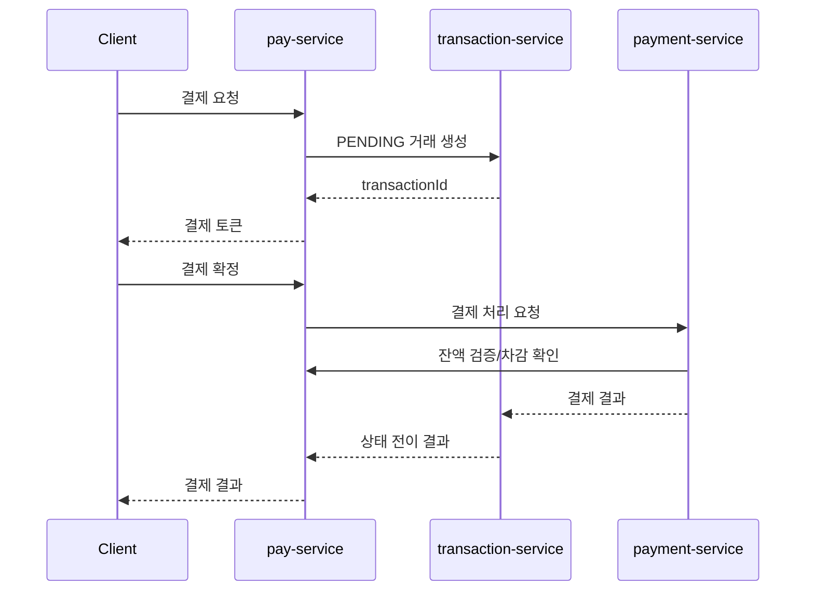

# Baseline Sequence: v2

```mermaid
sequenceDiagram
    participant Client
    participant Pay as pay-service
    participant Tx as transaction-service
    participant Payment as payment-service

    Client->>Pay: 결제 요청
    Pay->>Tx: PENDING 거래 생성
    Tx-->>Pay: transactionId
    Pay-->>Client: 결제 토큰

    Client->>Pay: 결제 확정
    Pay->>Payment: 결제 처리 요청
    Payment->>Pay: 잔액 검증/차감 확인
    Payment-->>Tx: 결제 결과
    Tx-->>Pay: 상태 전이 결과
    Pay-->>Client: 결제 결과
```

## 한계

- Pay가 흐름 조율과 Ledger 책임을 함께 가짐
- 서비스별 락 키가 달라 동일 사용자 원장 변경 직렬화 기준이 분산됨
- 결제 성공 판단과 원장 변경 책임이 섞임
