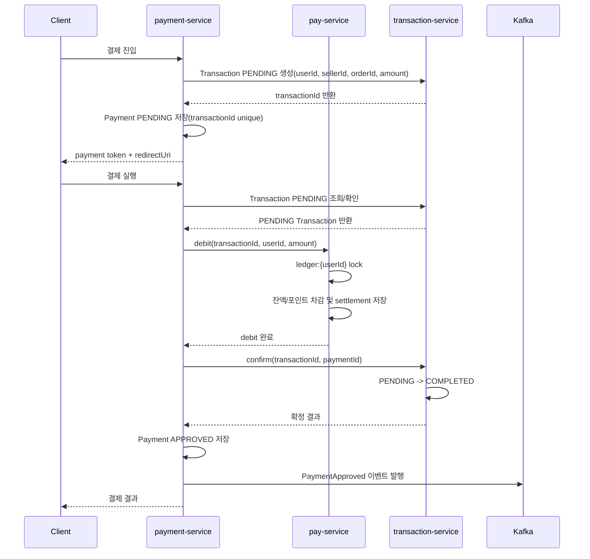
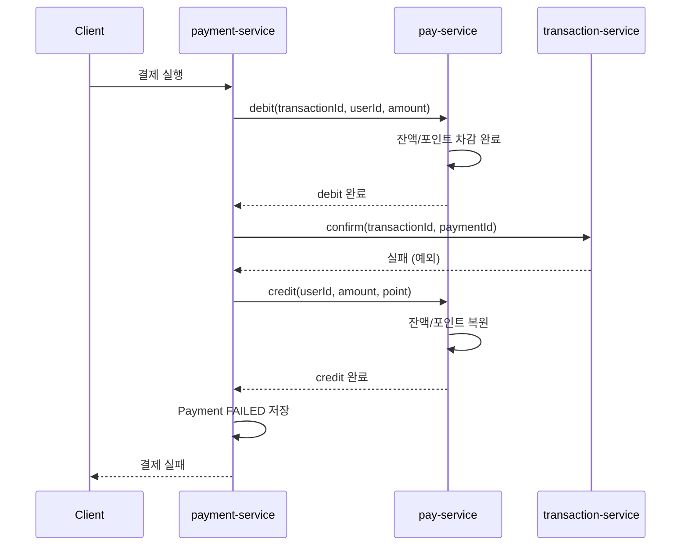

# Refactor Target Sequence: v3

## 정상 흐름

## 보상 트랜잭션 흐름 (Transaction confirm 실패)

credit 자체가 실패하면 에러 로그를 남기고 수동 처리 대상으로 분류

## 개선점

- Payment가 오케스트레이터로 결제 흐름을 조율
- Pay는 Ledger 변경 책임에 집중
- Transaction PENDING 생성과 확정 호출은 Payment가 조율
- 금전 변경은 `userId` 기준으로 직렬화
- 중복 요청은 `transactionId` 기반 unique constraint로 제어
- debit 성공 후 confirm 실패 시 보상 트랜잭션(credit)으로 잔액/포인트 복원
- 결제 완료 후속 처리는 PaymentApproved 이벤트를 기준으로 확장
